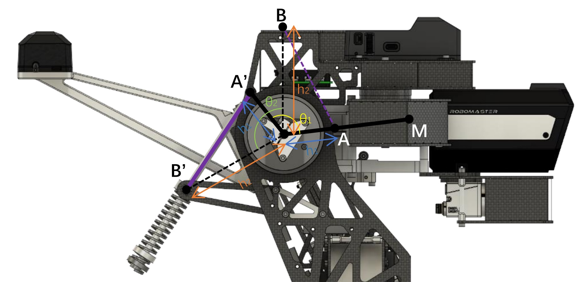

**Updating......**

# General





# Vision Tracking

Videos below show a system that detects and predicts the movement of the robot's armor, tracks the armor with a gimbal then boosts the ball to hit the armor considering the flying time.




# Mechanical Design

## Gravity Compensation

**[3-DOF Gravity Compensation Mechanism for Robot Waists with the Variations of Center of Mass](https://ieeexplore.ieee.org/document/8968046)** and 
**[Energy-free Systems; Theory, conception and design of statically balanced spring mechanisms](https://www.researchgate.net/publication/280922819_Energy-free_Systems_Theory_conception_and_design_of_statically_balanced_spring_mechanisms)**
shows a gravity compensation can perfectly balance one joint in any position with a zero-length spring, I found that this mechanism can be used on the RoboMaster gimbal, because the load of the gimbal's pitch motor is very large under the mechanical design constraints, and the chassis is generally driven on the flat ground.


$$
\frac{mgL}{kh_1} = h_2
$$


